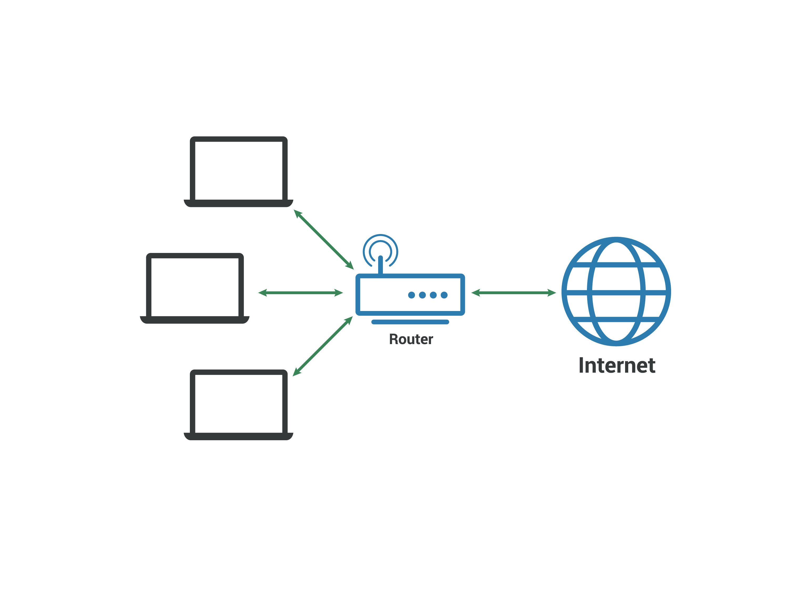

## [필수]

## 인터넷과 네트워크

---

### 네트워크

 네트워크는 컴퓨터 단말기들이 통신망으로 연결된 상태를 의미한다. 연결된 단말들은 서로 자원, 파일등의 전기적인 상호작용을 진행하는 것이 가능하도록 동일한 프로토콜을 사용하여 구성되며 일반적으로  LAN과 WAN 두 가지 유형으로 나뉜다.

### **Local Area Network**



LAN은 상대적으로 작은 영역에 국한된 네트워크인 근거리 통신망이다. 일반적으로 이더넷을 기반으로 구성되며 네트워크 내의 기기들은 WAN과 연결되어 있는 라우터를 통해 인터넷을 사용하거나 상호간의 통신이 가능하다. LAN 내부에서 기기들은 이더넷이나 WLAN을 통해 유/무선으로 연결된다. LAN은 Peer-to-Peer, Client-Server 두 가지 유형이 일반적으로 사용된다. 

홈 네트워크로 많이 사용되는 Peer-to-Peer(P2P) 방식은 속한 기기들이 서로 동등한 관계를 가지고 통신하며 서로와 적접적으로 연결되어 네트워크를 형성하는 구조이다. 중앙 서버가 없이 직접 연결되어 개별적으로 작동하고 데이터를 장치에 스스로 저장하게 된다. 

Client-Server 방식의 LAN은 네트워크에서 서비스를 제공하는 서버와 이 서비스를 요청하고 사용하는 클라이언트로 구성된다. 클라이언트는 서버에게 요청(Request)을 보내고, 서버는 요청에 대한 응답(Response)을 제공한다. 클라이언트는 서버가 제공하는 서비스나 데이터를 사용하여 작업을 수행하고 결과를 받아오는 방식으로 통신이 이루어 진다. 

### Ethernet

이더넷은 컴퓨터 네트워크를 위한 유선 통신 기술로, LAN에서 가장 널리 사용되는 표준 프로토콜이다. 이더넷은 데이터 링크 계층과 물리적인 네트워크를 연결하는 데 사용되며, 고속의 안정적인 데이터 전송을 제공한다. 이더넷은 일반적으로 흔히 랜선이라고 불리는 UTP 케이블을 통해 연결되며 CSMA/CD 프로토콜을 사용하여 충돌을 방지하고 네트워크 효율성을 향상시킨다. 

### Wireless Local Area Network

WLAN은 2.4GHz와 5GHz 등의 주파수 대역을 통해 이루어지는 근거리 무선 통신기술이다. 무선 액세스포인트(AP)를 통해 연결되어 중앙 집중식으로 데이터를 전송하고 관리하거나, 각각의 기기들이 서로 직접 통신하여 네트워크를 형성한다. 일반적으로 사용하는 공유기는 WAN과 LAN을 연결하는 라우터의 역할과 무선 네트워크 연결을 제공하는 AP의 역할을 같이 수행한다. WLAN은 신호의 감쇠, 다중 경로 간섭 등의 이유로 LAN과는 달리 CSMA/CA 프로토콜을 사용하여 충돌을 감지하는 것이 아닌 충돌을 피해 다른 채널에 연결하는 방식으로 동작한다. 

### Wide Area Network

WAN은 LAN과는 반대로 넓은 영역을 커버하는 네트워크이다. 회선이나 광섬유, 위성 및 무선통신 등 여러가지 통신 기술을 통해 연결되며 각각의 LAN들도 WAN을 통해 서로와 연결될 수 있다. 

### 인터넷

전세계적으로 연결된 컴퓨터 네트워크의 집합체로 TCP/IP 프로토콜을 통해 정보를 주고 받는 WAN의 일종이다. ‘네트워크의 네트워크’역할을 하여 모든 서비스를 제공하는 중심이 되는 호스트가 존재하는 구조가 아니라 인터넷상의 어떤 컴퓨터, 네트워크에 이상이 발생하더라도 전체에는 영향을 주지 않게 분산적으로 서비스된다. 현재에는 주로 웹을 통해 정보의 공유와 접근이 서비스된다.  

### TCP/IP

인터넷으로 서로 정보를 주고받을 때 사용되는 프로토콜로, OSI 7레이어의 3, 4번째 단계인 Network Layer와 Transport Layer단계 적용되어 네트워크 통신을 위해 데이터를 패킷으로 나누고, 전송하고, 수신하는 데 사용되어 데이터 전송의 신뢰성을 보장한다. 


**TCP**(Transmission Control Protocol)는 Transport Layer에 적용되는 전송 조절 프로토콜로 네트워크를 통해 전송되는 데이터의 순서를 유지하고 에러 복구 기능을 제공한다. TCP는 통신을 위해 세션을 유지하는 연결지향성을 띄고, 수신자의 처리능력에 맞춰 데이터의 송수신 속도를 조절하는 흐름제어 역할을 수행한다. 또한 데이터를 세그먼트로 나누어 전송하고 데이터의 순서와 내용을 확인하여 전송 성공 여부를 전달한다. 

**IP**(Internet Protocol)은 Network Layer에 적용되는 프로토콜로 주소 지정을 통해 통신이 이루어지는 두 사용자(End Point)사이의 경로와 목적지를 찾아주는 역할(Routing)을 한다. IP는 각 네트워크 장치에 고유한 주소를 할당하여 식별 가능하게 하고, 그 주소를 통해 전송하는 데이터의 출발점과 도착점을 식별하여 도달을 위한 경로를 설정한 뒤, 데이터를 패킷 단위로 나누어 전송한다. 이 과정에서 각각의 패킷에 출발과 도착점 IP주소를 포함하여 정확한 전달이 이루어질 수 있도록 한다.

### World Wide Web

인터넷 상에서 정보를 공유하고 검색할 수 있는 정보 시스템이다. WWW는 HTTP 프로토콜을 통해 서버와 클라이언트 간의 데이터 전송을 관리하고 HTML을 통해 작성된다.

## http란

---

Hypertext Transfer Protocol은 WWW에서 데이터를 주고받을 때 사용하는 Application Layer의 프로토콜로 TCP를 통해 전달하여 통신의 신뢰성을 보장한다. HTTP는 클라이언트가 서버에게 요청(Request)을 보내면, 서버는 이 요청에 대해 응답(Response)을 반환하는 형태로 동작한다. 이러한 과정은 기본적으로 Statelses, Connectionless의 성격을 띈다. 즉, 이전 요청과 연결에 대한 상태를 유지하지 않아 서버에 종속적이지 않으며, 요청에 대한 응답을 받으면 바로 TCP/IP 연결을 끊어 자원을 효율적으로 관리할 수 있도록 한다. HTTP 요청은 Start Line, Header, Body로 이루어져 있고 HTTP 응답은 Status Line, Header, Body로 구성된다. 

### **HTTP Request**

```yaml
POST /member/new HTTP/1.1

Host: localhost:8080
User-Agent: PostmanRuntime/7.29.0
Accept: */*
Cache-Control: no-cache
Postman-Token: d5a4f9c3-2cf5-4f29-bb9d-9c3aeb7f8b7e
Accept-Encoding: gzip, deflate, br
Connection: keep-alive
Content-Type: application/json
Content-Length: 62

{
    "name": "ww"
}
```

- Start Line
    
    ```yaml
    POST /member/new HTTP/1.1
    ```
    
    일반적인 HTTP 요청의 Start Line은 이런 형태를 가진다. 
    
    - HTTP 메서드
        - `POST` 가 해당하는 부분으로 서버에게 수행하게 할 동작을 나타낸다.
    - Requset Target (URI)
        
        ```yaml
        **scheme:**[**//**[**user**[**:password**]**@**]**host**[**:port**]][**/path**][?**query**][#**fragment**]
        ```
        
        - URI는 Uniform Resource Identifier로 네트워크상에 존재하는 리소스를 식별하는 문자열이다. 웹 주소를 나타내는 URL을 포함하여 직접적인 파일 위치가 아니더라도 해당 리소스를 식별할 수 있는 주소이다.
        - `/member/new` 이 해당하는 부분으로 메서드 뒤에 작성하며 절대경로와 쿼리 문자열을 연결하여 사용하거나 전체 URL을 표기하여 사용할 수 있다.
    - HTTP 버전
        - `HTTP/1.1` 이 해당하는 부분으로 Target URI 뒤에 위치하여 응답에서 사용해야 할 HTTP 버전을 표시하는 역할을 한다.
- Header
    
    ```yaml
    Host: localhost:8080
    User-Agent: PostmanRuntime/7.29.0
    Accept: */*
    Cache-Control: no-cache
    Postman-Token: d5a4f9c3-2cf5-4f29-bb9d-9c3aeb7f8b7e
    Accept-Encoding: gzip, deflate, br
    Connection: keep-alive
    Content-Type: application/json
    Content-Length: 62
    ```
    
    - `:` 을 기준으로 나뉘는 이름과 값으로 이루어진 형태로 요청에 대한 정보들을 전달한다.
    - Request Header는 서버에게 요청에 대한 추가 정보를 제공하거나 특정한 동작을 요청하는 역할을 한다.
    - General Header는 주로 연결에 관련하여 요청과 응답 메시지 전체에 적용되는 내용이다.
    - Entity Header는 Body에 포함된 데이터에 대한 내용을 담고 있는 헤더이다.
- Body
    
    ```json
    {
        "name": "ww"
    }
    ```
    
    - 헤더의 끝 부분에  공백 줄을 삽입한 뒷 부분에 위치하며 모든 요청에 존재하지는 않는다. 일반적으로 `GET`, `HEAD`등과 같이 요청한 리소스를 가져오는 메서드에는 필요하지 않고, 보통 서버에 업데이트를 위한 데이터를 제공하는 역할을 한다.

### HTTP Response

```yaml
HTTP/1.1 200 OK
Content-Type: application/json
Transfer-Encoding: chunked
Date: Sat, 17 May 2024 03:36:58 GMT
Keep-Alive: timeout=60
Connection: keep-alive
 
{
"id":1,
"name":"ww"
 }
```

- Status Line
    
    ```yaml
    HTTP/1.1 200 OK
    ```
    
    - HTTP 버전 `HTTP/1.1`
    - Status Code `200`
    - Status Message `OK`
- Header
    
    ```yaml
    Content-Type: application/json
    Transfer-Encoding: chunked
    Date: Sat, 17 May 2024 03:36:58 GMT
    Keep-Alive: timeout=60
    Connection: keep-alive
    ```
    
    요청과 응답에 대한 메타데이터를 포함함
    
- Body
    
    ```yaml
    {
    "id":1,
    "name":"ww"
     }
    ```
    
    - 요청에 대한 실제 데이터를 제공하는 부분으로 HTML, XML, JSON등의 형식으로 구성된다. HTTP 메서드에 따라 포함 여부가 결정된다.

## http 메서드

---

클라이언트가 서버에게 수행을 요청할 작업의 종류를 나타내는 요소이다. 일부 메서드는 요청 본문에 데이터를 포함하고 서버의 리소스를 수정하는 메서드도 존재한다.

1. `GET` : 서버에서 데이터를 조회할 때 사용하는 메서드로 요청 본문을 포함하지 않는다.
2. `POST` : 서버에 데이터를 전송하여 새로운 리소스를 생성하거나 기존 리소스를 수정할 때 사용하는 메서드로 요청 본문을 포함한다. 
3. `PUT` : 서버에 지정된 리소스를 생성하거나 대체하는 메서드로 요청 본문에 수정할 데이터를 포함한다.
4. `DELETE` : 서버에서 해당하는 리소스를 삭제하는 메서드이다.
5. `HEAD` : GET 메서드와 동일한 요청을 수행하되, 응답 본문을 포함하지 않는다.
6. `OPTIONS` : 서버가 지원하는 HTTP 메서드의 목록을 요청하는 메서드이다.
7. `PATCH` : 리소스의 일부분을 수정하는 메서드로 요청 본문을 포함한다.
8. `TRACE` **:** 서버에서 받은 요청을 그대로 반환하여 요청 경로를 추적하는 메서드로 디버깅 목적으로 사용한다.
9. `CONNECT` : 클라이언트와 서버 사이의 연결을 설정하는 메서드로 프록시 서버를 통해 HTTPS 요청을 보낼 때 사용된다.

## http 상태 코드

---

HTTP Request에 대한 처리 결과를 나타내는 3자리 숫자로 Response Statuse Line에 포함된다. 

- **1xx (Informational)**: 요청이 수신되어 처리 중
- **2xx (Successful)**: 요청이 성공적으로 수신되고 처리됨
- **3xx (Redirection)**: 클라이언트는 다른 위치로 리다이렉션되어야 함
- **4xx (Client Error)**: 클라이언트의 요청에 오류가 있음 (예: 404 Not Found)
- **5xx (Server Error)**: 서버가 요청을 처리하는 도중 오류가 발생함 (예: 500 Internal Server Error)

## Rest API란

---

### Application Programming Interface

API는 여러 애플리케이션 간의 상호작용이 가능하도록 일치시킨 명령어, 함수, 프로토콜 등이다. 일반적으로 JSON, XML등을 사용하여 데이터를 주고받고 특정 작업을 수행하는 메서드를 통해 상호작용한다. 

REST API는 /member/1과 같은 path등의 URI를 통해 자원들을 식별하고, HTTP메서드들을 사용하는 웹 서비스 API이다. 다양한 프레임 워크에서 REST API를 지원하여 클라이언트-서버 간의 통신을 효율적으로 이루어질 수 있도록 한다. 

코드구현 : 

https://github.com/Juuuu-power-e/cow_mvc_practice

